# **Python - Task Manager - Prepared by Abdullah Woaky**

## **About the Project** 
This software can be used by a small business and can help to manage tasks assigned to each member of the team.
The program allows the users to do the following:
1) Login. The user will be prompted to enter a username and valid password. The error message will be displayed if the user enters invalid username or / and password. 
2) Once logged in The menu with choices will be displayed, once the user has successfully logged in. The user will be able add new task for existing users, view all tasks or view only specific users' tasks and also be able to edit specific task's details.
3) The Admin user will have additional access to register a new user, generate reports and view statistics.

## **Table of Contents**
1. [About the Project](#project)
2. [Built With](#paragraph1)
3. [Required Installations](#paragraph2)
    1. [Installing](#subparagraph1)
    2. [Instructions](#subparagraph2)
4. [How to use project](#paragraph33)
5. [Contact](#paragraph3)
6. [Special Thanks](#paragraph4)
7. [Contributing](#paragraph5)
8. [Show your support](#paragraph6)

## Built With 
The project was developed using Python programming language.

## Required Installations 

### Installing 
Install the python IDE to get this project running in your machine:
Python

Click [here](https://www.python.org/downloads/windows/) to install Python. 

### Instructions 

Follow these steps:
Download the python file and other supporting file into a folder or just clone the repository.

Clone the Repository from here:
https://github.com/Waki2000/finalcapstone

## How to use project 

---> When the program is started, the user will be prompted to enter username and password. Error message will be displayed if the user enters invalid username or password.

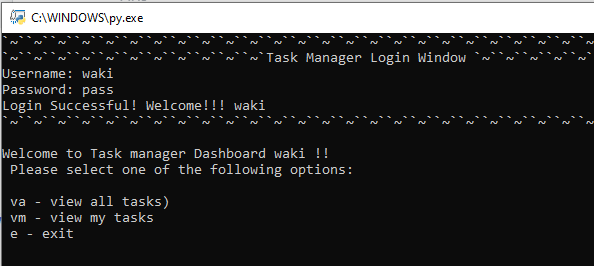
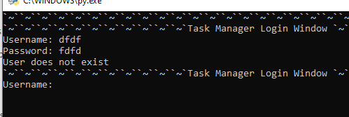

---> Once the user has successfully logged in, the main menu will be displayed in order for a user to choose from the options provided. 
  Menu for admin access:

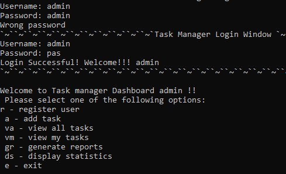
---> This program will help to do the following:

1) Register a new user (admin only!). Error message will be displayed if password confirmation doesn't match to initial password or user has already exists. 

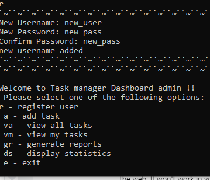

2) Add a new task
 
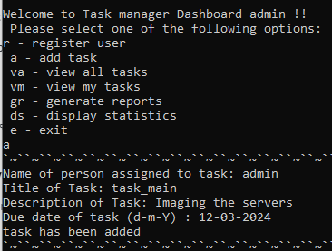

3) View all tasks

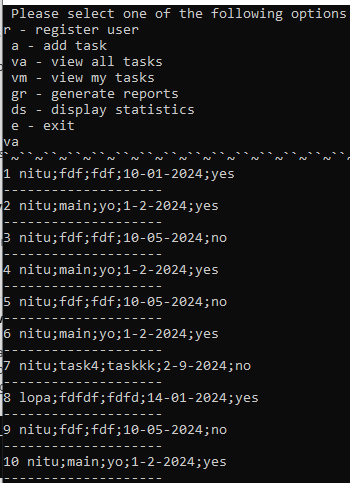

4) View specific user tasks

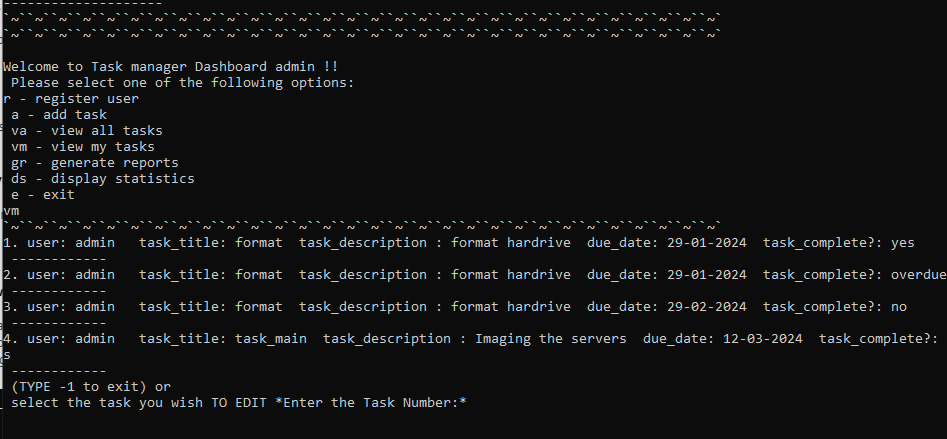
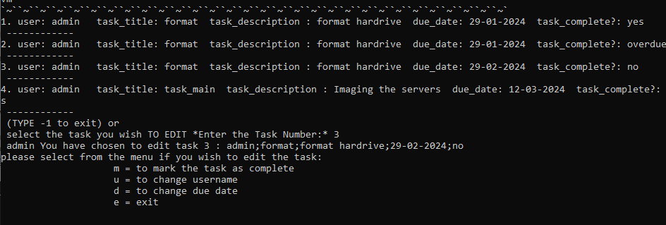

5) Display statistics (admin only!)

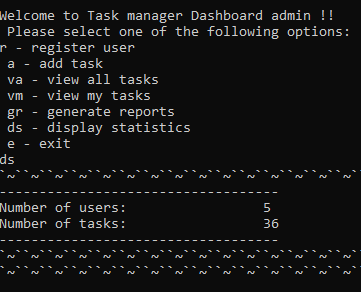

6) Generate reports
 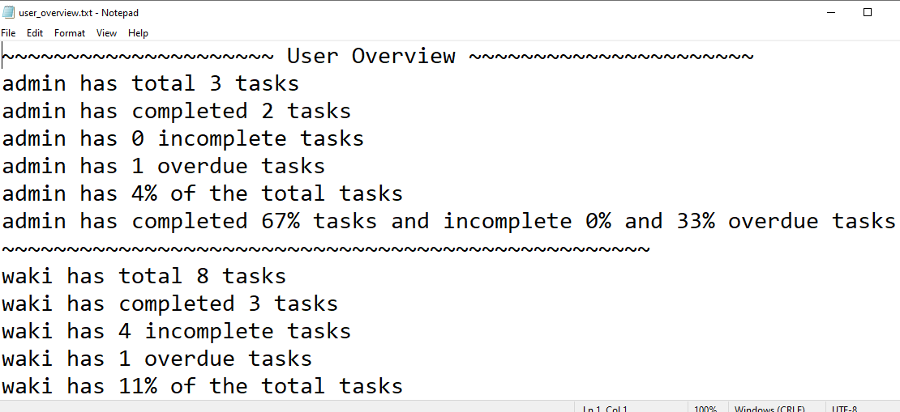
 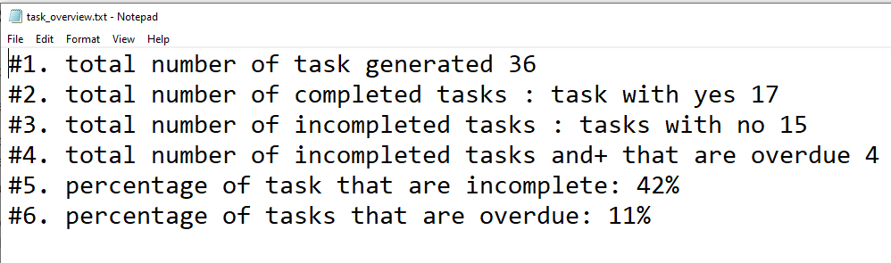
7) Finally Exit the program by pressing button e
 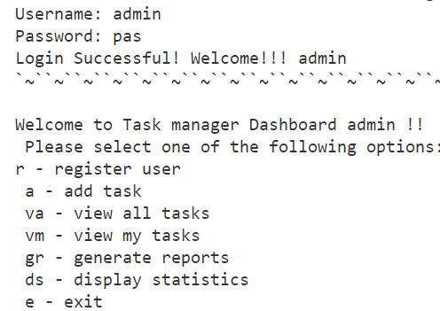

## Contact 
💃 **Abdullah Woaky**

LinkedIn: [Abdullah Woaky](https://www.linkedin.com/in/abdullah-woaky-96ab7914/)

Project Link: https://github.com/Waki2000/finalCapstone

## Special Thanks 
Special Thanks to HyperionDev for this great learning experience

## 🤝 Contributing 
Contributions are welcome!

## Show your support 
Give a hi5 Star ⭐️ to you if you have read this far, Many thanks !
